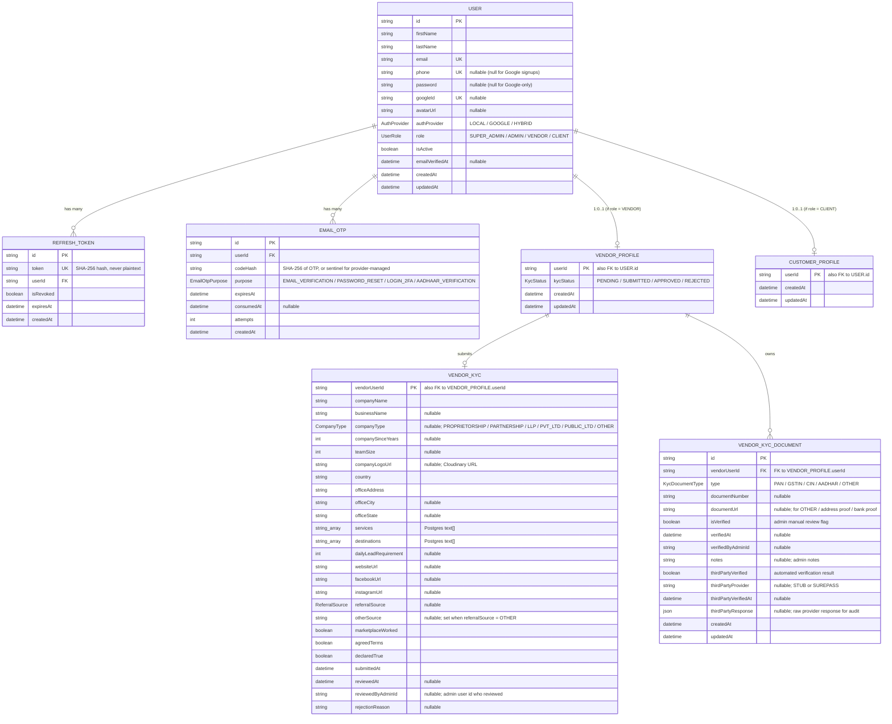

# Tripz Database — Entity Relationship Diagram

Generated from the Prisma schema at [`prisma/schema/`](../prisma/schema/).

The diagram below is written in [Mermaid](https://mermaid.js.org). It renders automatically on:

- **GitHub** — view this file in the GitHub web UI; the diagram appears as an image.
- **VS Code** — install the [Markdown Preview Mermaid Support](https://marketplace.visualstudio.com/items?itemName=bierner.markdown-mermaid) extension, then press `Ctrl+Shift+V` to preview.
- **JetBrains IDEs** — built-in Mermaid support; preview the markdown file.
- **mermaid.live** — copy the code block contents to https://mermaid.live for an interactive editor.

## Diagram



## Relationships in plain English

| From | → | To | Cardinality | Meaning |
|---|---|---|---|---|
| User | → | RefreshToken | 1 : 0..N | A user can have many active sessions (one refresh token per session). |
| User | → | EmailOtp | 1 : 0..N | A user has many OTP records over their lifetime (verification, reset, Aadhaar). |
| User | → | VendorProfile | 1 : 0..1 | Exists only if `User.role = VENDOR`. |
| User | → | CustomerProfile | 1 : 0..1 | Exists only if `User.role = CLIENT`. |
| VendorProfile | → | VendorKyc | 1 : 0..1 | Created when the vendor first submits the KYC wizard. |
| VendorProfile | → | VendorKycDocument | 1 : 0..N | One row per verified document (PAN, GSTIN, CIN, Aadhaar, OTHER). |

**`ON DELETE CASCADE` is set everywhere** — deleting a User wipes all their tokens, OTPs, profile, KYC, and documents transactionally.

## Enum reference

| Enum | Values | Used in |
|---|---|---|
| `UserRole` | `SUPER_ADMIN`, `ADMIN`, `VENDOR`, `CLIENT` | `User.role` |
| `AuthProvider` | `LOCAL`, `GOOGLE`, `HYBRID` | `User.authProvider` |
| `EmailOtpPurpose` | `EMAIL_VERIFICATION`, `PASSWORD_RESET`, `LOGIN_2FA`, `AADHAAR_VERIFICATION` | `EmailOtp.purpose` |
| `KycStatus` | `PENDING`, `SUBMITTED`, `APPROVED`, `REJECTED` | `VendorProfile.kycStatus` |
| `CompanyType` | `PROPRIETORSHIP`, `PARTNERSHIP`, `LLP`, `PVT_LTD`, `PUBLIC_LTD`, `OTHER` | `VendorKyc.companyType` |
| `ReferralSource` | `REFERENCE`, `GOOGLE`, `SOCIAL_MEDIA`, `ADVERTISEMENT`, `OTHER` | `VendorKyc.referralSource` |
| `KycDocumentType` | `PAN`, `GSTIN`, `CIN`, `AADHAR`, `OTHER` | `VendorKycDocument.type` |

## Key constraints / indexes

| Table | Constraint | Notes |
|---|---|---|
| `users` | `UNIQUE(email)`, `UNIQUE(phone)`, `UNIQUE(googleId)` | Multiple rows may have `phone = NULL` or `googleId = NULL` (Postgres allows it for unique indexes). |
| `users` | `INDEX(role)` | Speeds up role-based queries. |
| `refresh_tokens` | `UNIQUE(token)`, `INDEX(userId)`, `INDEX(expiresAt)` | Lookup by hash; bulk-revoke per user; cleanup expired. |
| `email_otps` | `INDEX(userId, purpose)`, `INDEX(expiresAt)` | Fast lookup of active OTPs. |
| `vendor_profiles` | `INDEX(kycStatus)` | Admin queue queries (e.g., "all SUBMITTED"). |
| `vendor_kyc_documents` | `UNIQUE(vendorUserId, type)` | Exactly one doc of each type per vendor. |

## Regenerating this diagram

This file was hand-written from the schema. To keep it in sync after schema changes:

- **Quick way:** edit this file directly when you change `prisma/schema/*.prisma`.
- **Automated way (optional):** install [`prisma-erd-generator`](https://github.com/keonik/prisma-erd-generator) — it adds an `erd` generator to your Prisma schema and outputs SVG/PDF/Mermaid on every `prisma generate`. Adds a build step but stays accurate.

## File location

This file lives at `docs/er-diagram.md` (alongside `docs/openapi.json`).

To view:
1. Open in VS Code → `Ctrl+Shift+V` → Markdown preview with Mermaid rendering.
2. Push to GitHub → diagram renders inline when viewing this file on GitHub.com.
3. Copy the ` ```mermaid ... ``` ` block into https://mermaid.live for an interactive editor.
